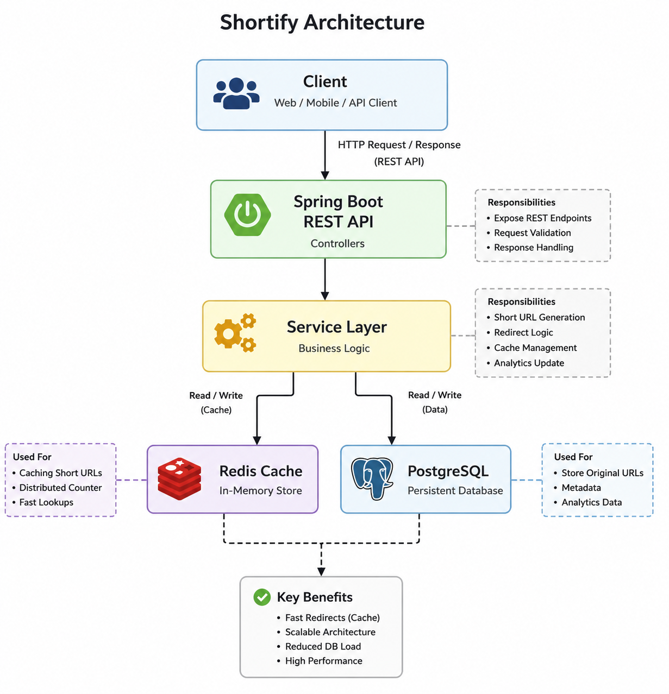

# Shortify - Scalable URL Shortener

Shortify is a scalable backend URL shortening platform built with Java and Spring Boot.
<br>It focused on implementing real-world system design & backend engineering concepts including:
The project focuses on  concepts such as:
- Redis-based counters generation
- REST APIs
- Redis caching
- Rate limiting
- URL expiry handling
- Scalable architecture design
- high-performance URL redirection etc.

---

# Features

## Core Features
- Short URL generation
- URL redirection
- Expiry support
- Unique short links for every request

## Backend Engineering Features
- Redis-based distributed atomic counter
- Cache-aside pattern using Redis
- Per-IP rate limiting using Bucket4j
- Base62 encoding
- PostgreSQL persistence
- Non-predictable short code generation

---

# Tech Stack

| Technology | Purpose |
|---|---|
| Java 21 | Backend Language |
| Spring Boot | Backend Framework |
| PostgreSQL | Persistent Database |
| Redis | Caching + Distributed Counter |
| Bucket4j | Rate Limiting |
| Maven | Dependency Management |

---

# Architecture

The application follows a layered backend architecture with Redis caching and PostgreSQL persistence.

<p align="center">
  
</p>

---

# Redis Usage

Redis is used for:

## 1. Distributed Counter Generation
Used for generating unique short codes atomically.

Example:
url_counter -> 125

---

## 2. URL Caching
Used to reduce database load during redirects.

Example:
short:Xa12 -> https://google.com

---

# Short URL Generation Flow

```text
Client Request
      ↓
Redis Atomic Counter
      ↓
Base62 Encoding
      ↓
Random Prefix Added
      ↓
Persist to PostgreSQL
      ↓
Return Short URL
```

---

# Redirect Flow

```text
GET /{shortCode}
↓
Check Redis Cache
↓
Cache Hit -> Redirect
↓
Cache Miss -> PostgreSQL Lookup
↓
Store in Redis
↓
Redirect User
```

---

# Rate Limiting

Implemented per-IP rate limiting using Bucket4j.

Limits:
- 10 requests per minute per IP

Purpose:
- Prevent abuse
- Avoid API flooding
- Protect backend resources

---

# API Endpoints

## Create Short URL

**POST /api/v1/urls**

Request:
```json
{
  "url": "https://google.com",
  "expiryInDays": 7
}
```

Response:
```json
{
  "shortUrl": "http://localhost:8080/Xa12"
}
```

---

## Redirect URL

**GET /{shortCode}**

Redirects user to original URL.

---

# Setup Instructions

## Clone Repository

```bash
git clone https://github.com/GeekyHim/Shortify-URL-Shortner-Project
```

---

## Configure PostgreSQL

Create database:
```sql
CREATE DATABASE url_shortener;
```

Update:
src/main/resources/application.properties
with database credentials.

---

## Run Redis

```bash
docker run --name redis-shortify -p 6379:6379 -d redis
```

---

## Run Application

```bash
mvn spring-boot:run
```

---

# Future Improvements

- Global exception handling
- Analytics endpoint 
- Docker Compose support
- Async analytics processing 


---
# Learning Outcomes

This project helped in understanding:

- Scalable backend architecture
- Redis caching and distributed counters
- RESTful API design
- Rate limiting and API protection
- Backend performance optimization
- Integration of Redis with Spring Boot
- Designing production-oriented backend services
- Designing systems for reduced database load

It significantly strengthened my practical understanding of backend engineering, System Design, Java Spring Boot, Redis, scalable systems and production-oriented development.